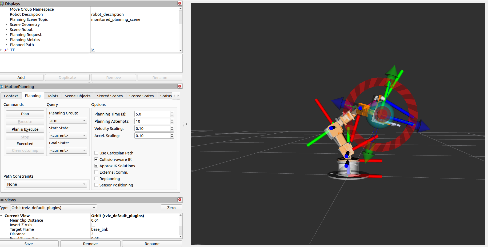
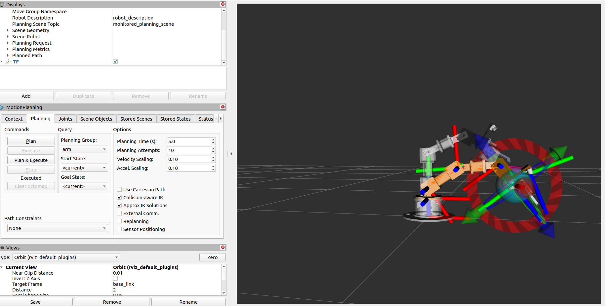
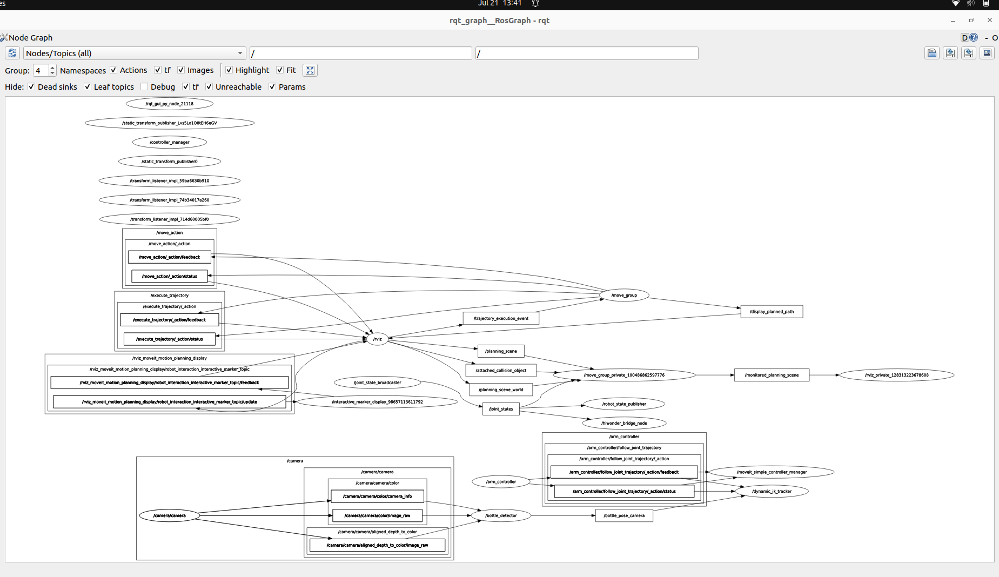

# 5-DOF Robotic Arm Pick-and-Place using ROS2 Humble

## Overview

This repository contains the complete software stack developed for a custom 5-DOF robotic arm capable of detecting and localizing objects using computer vision, transforming detections into the robot base frame, and performing inverse kinematics for manipulation.

The project was developed entirely on **ROS2 Humble** and integrates perception, motion planning, inverse kinematics, robot simulation, and SLAM into a single workspace.
<p align="center">


</p>
---

# Features

- Custom 5-DOF robotic arm
- Custom URDF robot model
- MoveIt2 motion planning
- TRAC-IK inverse kinematics
- IKPy inverse kinematics
- YOLO-based bottle detection
- Intel RealSense D435i RGB camera
- TF2 transform tree
- Bottle localization in robot Base Frame
- RTABMap RGB-D SLAM
- ROS2 Humble
- RViz visualization
- Joint trajectory execution
- Camera mounted on end-effector

---

# Software Stack

## Operating System

- Ubuntu 22.04

## Middleware

- ROS2 Humble

## Motion Planning

- MoveIt2
- OMPL
- RRTConnect Planner

## Inverse Kinematics

- TRAC-IK
- IKPy

TRAC-IK is used wherever robust inverse kinematics is required inside the MoveIt framework.

IKPy is used independently for Python-based inverse kinematics calculations.

---

# Perception

- Intel RealSense D435i
- YOLO Object Detection
- OpenCV
- cv_bridge

The RGB camera continuously detects bottles.

The detected bottle pose is transformed into the robot Base Frame using TF2.

---

# Camera Frame

Unlike many standard implementations that use

```
camera_color_optical_frame
```

this project performs all processing directly in

```
camera_color_frame
```

The complete TF tree is generated through robot_state_publisher.

---

# Coordinate Frames

[View Coordinate Frames Documentation (PDF)](tf1.pdf)


# Object Localization

YOLO provides

- X
- Y
- Z

coordinates of the detected bottle with respect to

```
camera_color_frame
```

These coordinates are transformed into

```
base_link
```

so that the bottle position remains fixed in world coordinates regardless of robot arm motion.

---

# Motion Planning

Planning framework:

- MoveIt2

Planning Library:

- OMPL

Planner:

```
RRTConnect
```

Trajectory execution is performed through the ROS2 JointTrajectoryController.

---
## Bottle Search State

During the searching phase, the robotic arm uses a PID-based visual servoing controller to align the camera view with the detected bottle.

The system continuously processes the camera feedback and adjusts only Joint 1 (J1) rotation to scan the workspace and center the bottle in the camera frame.

Workflow:

Camera Feed
  |
Bottle Detection
|
PID Controller
|
J1 Rotation Adjustment
|
Bottle Centered
|
Transition to Approach State

The PID controller provides smooth and stable J1 movement by reducing alignment error and preventing sudden oscillations during the search process.
# SLAM

RGB-D SLAM is performed using

```
RTABMap
```

This enables environmental mapping while maintaining robot localization.

---

# Robot Description

The robot is described using

- URDF
- Xacro

The repository includes

- robot meshes
- robot description
- ros2_control configuration
- MoveIt configuration
- controller configuration

---

# ROS Packages

Main packages include

```
arm_description

arm_moveit_config

arm_application

arm_bringup

arm_interfaces

arm_vision

bio_ik

trac_ik
```

---

# Main Libraries

- MoveIt2
- OMPL
- TRAC-IK
- IKPy
- TF2
- OpenCV
- cv_bridge
- RealSense SDK
- RTABMap
- robot_state_publisher
- joint_state_publisher
- ros2_control
- joint_trajectory_controller

---

# Repository Structure

```

src/

    arm_description/

    arm_moveit_config/

    arm_application/

    arm_bringup/

    arm_interfaces/

    arm_vision/

    bio_ik/

    trac_ik/

ros21_ws/

hiwonder.py

RTABmap-parameters
```

---

# Major Components

## Robot Description

Contains

- URDF
- Meshes
- Xacro
- Robot geometry

---

## MoveIt Configuration

Contains

- SRDF
- OMPL planner configuration
- Joint limits
- Kinematics
- Controllers
- RViz configuration

---

## Vision

Responsible for

- Camera interface
- YOLO inference
- Bottle detection
- Pose estimation

---

## TF

Maintains transforms between

- robot links
- camera
- world

Transforms bottle pose into

```
base_link
```

---

## Motion

Responsible for

- IK
- Planning
- Trajectory generation
- Trajectory execution

---
## Real Hardware Joint Control (Hiwonder Servo Interface)

The real robotic arm is controlled through the Hiwonder servo interface.

The joint states generated by the ROS 2 control pipeline are published and echoed by the joint state interface. These joint state commands are then converted into servo position commands by the Hiwonder controller, enabling synchronized movement of the physical robot arm.

Workflow:

Joint State Publisher
        |
Joint State Echo / Feedback
        |
Hiwonder Servo Interface
        |
Servo Position Commands
        |
Real Robotic Arm Movement


The Hiwonder control package acts as the hardware abstraction layer between ROS 2 joint commands and the physical servo motors.
There are 2 Hiwonder control interface . For usb-microusb . For uart to usb ttl adapter
Features:

- ROS 2 based joint command handling
- Joint state feedback monitoring
- Servo position synchronization
- Real-time hardware movement control
- Interface between simulation and physical robot

# End Goal


The final pipeline performs

```
RealSense RGB Image

↓

YOLO Detection

↓

Bottle Pose

↓

TF Transform

↓

Bottle Pose in base_link

↓

Inverse Kinematics

↓

Motion Planning

↓

Trajectory Generation

↓

Robot Execution
```

---

# Technologies Used

- ROS2 Humble
- Ubuntu 22.04
- MoveIt2
- OMPL
- RRTConnect
- TRAC-IK
- IKPy
- RTABMap
- Intel RealSense D435i
- OpenCV
- Python
- C++
- TF2
- RViz2
- ros2_control

---

# Future Work

- Grasp pose estimation
- Integrate SLAM
- Motion planning around dynamic obstacles
- Multi-object manipulation
- Autonomous pick-and-place pipeline with NLP
- Path optimization
- Gripper force feedback
- Full autonomous manipulation
